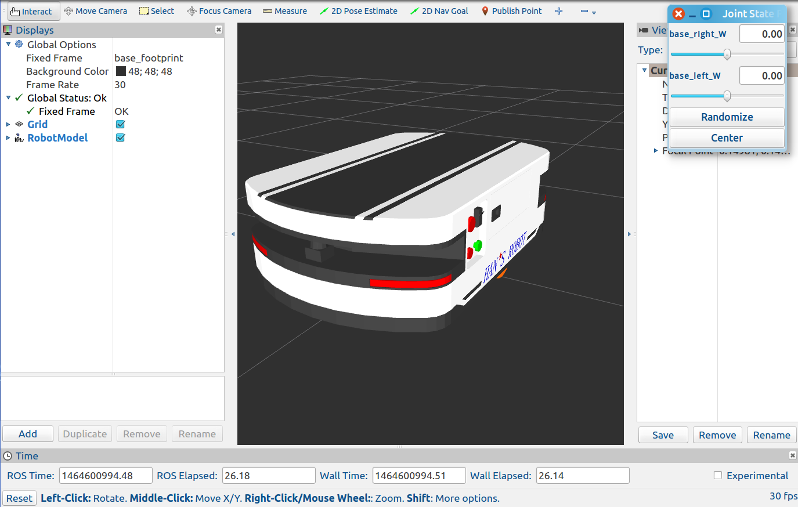
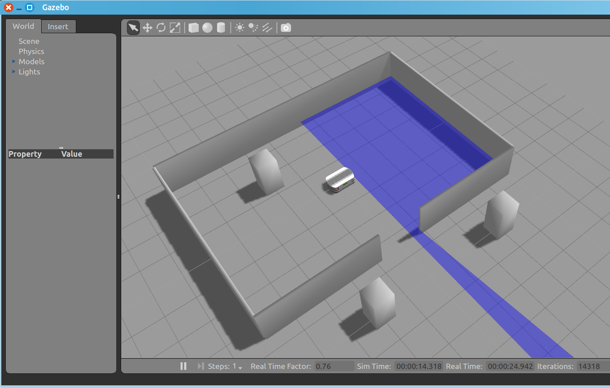
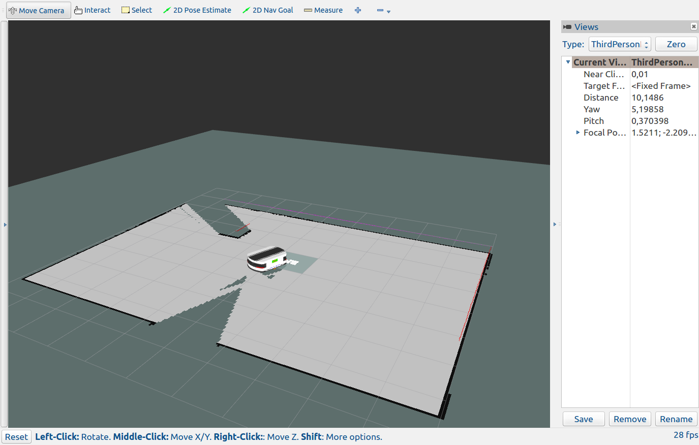

## Introduction to packages hansagv_description and hansagv_gazebo  

### URDF Model:  
launch urdf model in Rviz:  

`$ roslaunch hansagv_description hansagv_rviz.launch`  

And you should see the urdf model like so:  

 

<!---->

### Simulation in Gazebo:  
Before the simulation please install the following debs:  
```sh
$ sudo apt-get install ros-indigo-gmapping ros-indigo-map-server ros-indigo-amcl ros-indigo-move-base ros-indigo-turtlebot-navigation ros-indigo-turtlebot-teleop
```
The following command starts the hansagv in the simulated world  

`$ roslaunch hansagv_gazebo hansagv_lab.launch`



#### Make the hansagv move:

`$ roslaunch turtlebot_teleop keyboard_teleop.launch`  

#### Make a map and navigate with it:

To start map building, type:  

`$ roslaunch hansagv_gazebo gmapping.launch`  

Then use teleoperation tool to drive the AGV around the world, until you get satisfied with your map.   



Finally, save the map to disk:  

`$ rosrun map_server map_saver -f <your map name>`  

Navigate the playground:  

To be sure that all will run as expected, kill all you launched in the previous section and repeat all steps except the map building. Instead, type:  

`$ roslaunch hansagv_gazebo navigation.launch map_file:=<full path to your map YAML file>`  

The full path is for example: /home/username/catkin_ws/.../your map YAML file.